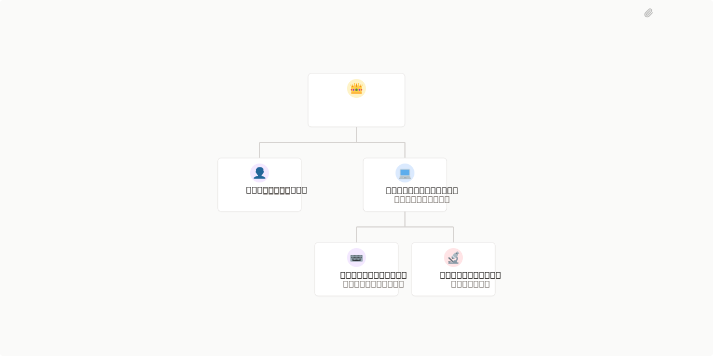

# GroomBook

> An open source business management solution for pet groomers.



## What's Inside

> This is an [Agent Company](https://agentcompanies.io) package from [Paperclip](https://paperclip.ing)

| Content | Count |
|---------|-------|
| Agents | 7 |
| Skills | 29 |

### Agents

| Agent | Role | Reports To |
|-------|------|------------|
| Barkley Trimsworth | Engineer | the-dogfather |
| Flea Flicker | Engineer | the-dogfather |
| Lint Roller | qa | the-dogfather |
| Pawla Abdul | CMO | scrubs-mcbarkley |
| Scrubs McBarkley | CEO | — |
| Shedward Scissorhands | qa | the-dogfather |
| The Dogfather | CTO | scrubs-mcbarkley |

### Skills

| Skill | Description | Source |
|-------|-------------|--------|
| github-app-token | Generate a GitHub installation access token from a GitHub App PEM key, App ID, and Installation ID, then authenticate the gh CLI with it. | [github](https://github.com/farhoodliquor/skills) |
| flux-controller-patch-releases | > | [github](https://github.com/fluxcd/agent-skills) |
| gitops-cluster-debug | > | [github](https://github.com/fluxcd/agent-skills) |
| gitops-knowledge | > | [github](https://github.com/fluxcd/agent-skills) |
| gitops-repo-audit | > | [github](https://github.com/fluxcd/agent-skills) |
| android-native-dev | Android native application development and UI design guide. Covers Material Design 3, Kotlin/Compose development, project configuration, accessibility, and build troubleshooting. Read this before Android native application development. | [github](https://github.com/MiniMax-AI/skills) |
| color-font-skill | Choose presentation-ready color palettes and font pairings for PPT/design tasks. Use when users ask for visual theme choices, brand-safe palettes, or font recommendations. Triggers include: 配色, 色板, 字体, color palette, font, PPT配色, 字体搭配. | [github](https://github.com/MiniMax-AI/skills) |
| design-style-skill | > | [github](https://github.com/MiniMax-AI/skills) |
| flutter-dev | | | [github](https://github.com/MiniMax-AI/skills) |
| frontend-dev | | | [github](https://github.com/MiniMax-AI/skills) |
| fullstack-dev | | | [github](https://github.com/MiniMax-AI/skills) |
| gif-sticker-maker | | | [github](https://github.com/MiniMax-AI/skills) |
| ios-application-dev | | | [github](https://github.com/MiniMax-AI/skills) |
| minimax-docx | > | [github](https://github.com/MiniMax-AI/skills) |
| minimax-multimodal-toolkit | > | [github](https://github.com/MiniMax-AI/skills) |
| minimax-pdf | > | [github](https://github.com/MiniMax-AI/skills) |
| minimax-xlsx | Open, create, read, analyze, edit, or validate Excel/spreadsheet files (.xlsx, .xlsm, .csv, .tsv). Use when the user asks to create, build, modify, analyze, read, validate, or format any Excel spreadsheet, financial model, pivot table, or tabular data file. Covers: creating new xlsx from scratch, reading and analyzing existing files, editing existing xlsx with zero format loss, formula recalculation and validation, and applying professional financial formatting standards. Triggers on 'spreadsheet', 'Excel', '.xlsx', '.csv', 'pivot table', 'financial model', 'formula', or any request to produce tabular data in Excel format. | [github](https://github.com/MiniMax-AI/skills) |
| ppt-editing-skill | Edit existing PowerPoint files or templates with XML-safe workflows. Use for template-based deck updates: analyze layouts, map content to slides, duplicate/reorder/delete slides safely, edit slide XML in parallel, clean orphaned assets, and repack validated PPTX output. | [github](https://github.com/MiniMax-AI/skills) |
| ppt-orchestra-skill | Plan and orchestrate multi-slide PowerPoint creation from scratch. Use before generating a full deck with subagents: classify each slide type, enforce visual variety, set typography/spacing rules, and run text-based QA to catch content issues. | [github](https://github.com/MiniMax-AI/skills) |
| pptx-generator | Generate, edit, and read PowerPoint presentations. Create from scratch with PptxGenJS (cover, TOC, content, section divider, summary slides), edit existing PPTX via XML workflows, or extract text with markitdown. Triggers: PPT, PPTX, PowerPoint, presentation, slide, deck, slides. | [github](https://github.com/MiniMax-AI/skills) |
| pr-review | > | [github](https://github.com/MiniMax-AI/skills) |
| react-native-dev | | | [github](https://github.com/MiniMax-AI/skills) |
| shader-dev | Comprehensive GLSL shader techniques for creating stunning visual effects — ray marching, SDF modeling, fluid simulation, particle systems, procedural generation, lighting, post-processing, and more. | [github](https://github.com/MiniMax-AI/skills) |
| slide-making-skill | Implement single-slide PowerPoint pages with PptxGenJS. Use when writing or fixing slide JS files: dimensions, positioning, text/image/chart APIs, styling rules, and export expectations for native .pptx output. | [github](https://github.com/MiniMax-AI/skills) |
| vision-analysis | > | [github](https://github.com/MiniMax-AI/skills) |
| paperclip-create-agent | > | [github](https://github.com/paperclipai/paperclip/tree/master/skills/paperclip-create-agent) |
| paperclip-create-plugin | > | [github](https://github.com/paperclipai/paperclip/tree/master/skills/paperclip-create-plugin) |
| paperclip | > | [github](https://github.com/paperclipai/paperclip/tree/master/skills/paperclip) |
| para-memory-files | > | [github](https://github.com/paperclipai/paperclip/tree/master/skills/para-memory-files) |

## Getting Started

```bash
pnpm paperclipai company import this-github-url-or-folder
```

See [Paperclip](https://paperclip.ing) for more information.

---
Exported from [Paperclip](https://paperclip.ing) on 2026-03-30
