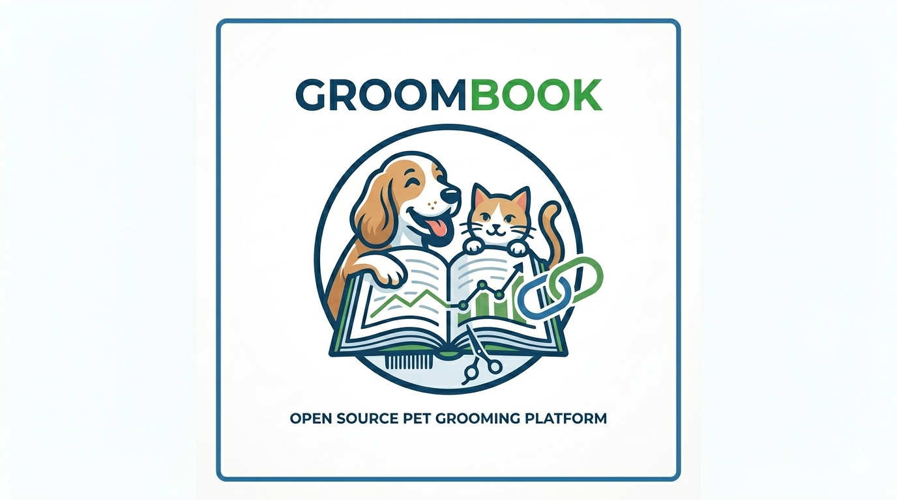

# 👋 Hey there, I'm Groombook

### 🐾 Open Source Pet Grooming Business Platform

Helping groomers run their businesses and pet owners find trusted help — no fluff.

---

## 🔗 Connect

---

## What We're Building

Everything a grooming business owner needs in one place — manage clients, scheduling, and day-to-day operations.

---

## 🛠️ Tech Stack

---

## 📊 GitHub Stats

---

## 🤝 Open Source

We believe in building in public. Star & watch our repos to follow along!

---

  

  <i>Happy pets. Happy owners. Happy groomers. 🐾</i>

